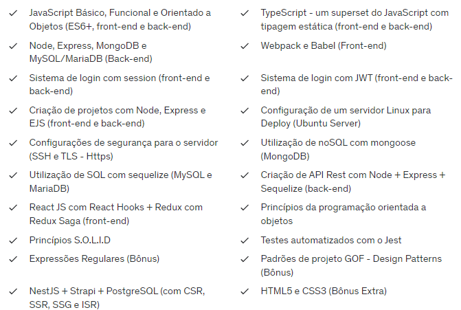

# Curso de JavaScript e TypeScript do básico ao avançado JS/TS

#### Grade curricular:

  
  
  #### Duração: 146 horas.
  
  <a href="https://www.udemy.com/course/curso-de-javascript-moderno-do-basico-ao-avancado/" target="_blank">Link do Curso</a>

