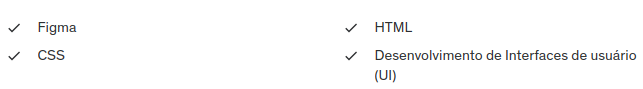

# Curso do FIGMA ao código. O design da interface web completo

#### Grade curricular:

  
  
#### Duração: 89 horas.

  <a href="https://www.udemy.com/course/curso-do-figma-ao-codigo-o-design-da-interface-web-completo/" target="_blank">Link do Curso</a>

