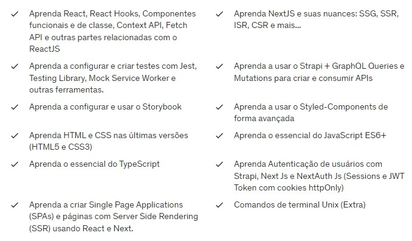

# Curso de React.Js e Next.Js

#### Grade curricular:

  
  
  #### Duração: 92 horas.
  
  <a href="https://www.udemy.com/course/curso-de-reactjs-nextjs-completo-do-basico-ao-avancado/?couponCode=LEADERSALE24A" target="_blank">Link do Curso</a>

